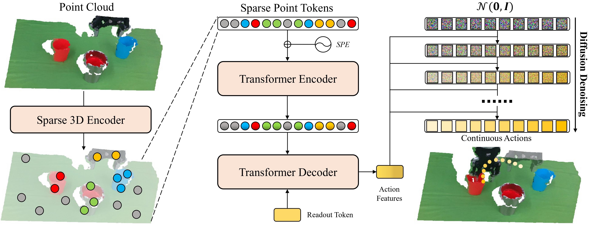

# 📈 RISE: 3D Perception Makes Real-World Robot Imitation Simple and Effective

[[Paper]](https://arxiv.org/pdf/2404.12281.pdf) [[Project Page]](https://rise-policy.github.io/) [[Sample Data]](https://drive.google.com/drive/folders/1eIjPKf_g-1DjYqMTYjSzVBixjnveyD89?usp=sharing)

**Authors**: [Chenxi Wang](https://github.com/chenxi-wang), [Hongjie Fang](https://tonyfang.net/), [Hao-Shu Fang](https://fang-haoshu.github.io/), [Cewu Lu](https://www.mvig.org/)


## 🔥 News

- **[Dec 26, 2024]** Fix several potential installation issues. Add support for CUDA 12.1.
- **[May 11, 2024]** Initial release.

## 🛫 Getting Started

### 💻 Installation

Please following the [installation guide](assets/docs/INSTALL.md) to install the `rise` conda environments and the dependencies, as well as the real robot environments. Also, remember to adjust the constant parameters in `dataset/constants.py` and `utils/constants.py` according to your own environment.

### 📷 Calibration

Please calibrate the camera(s) with the robot before data collection and evaluation to ensure correct spatial transformations between camera(s) and the robot. Please refer to [calibration guide](assets/docs/CALIB.md) for more details.

### 🛢️ Data Collection

We apply the data collection process in the <a href="https://rh20t.github.io/">RH20T</a> paper. We provide the sample data for each tasks on [Google Drive](https://drive.google.com/drive/folders/1eIjPKf_g-1DjYqMTYjSzVBixjnveyD89?usp=sharing) and [Baidu Netdisk](https://pan.baidu.com/s/1EO1rbXbc9qaQMhV3pHZLpw) (code: 643b). You may need to adjust `dataset/realworld.py` to accommodate different data formats. The sample data have the format of

```
collect_cups
|-- calib/
|   |-- [calib timestamp 1]/
|   |   |-- extrinsics.npy             # extrinsics (camera to marker)
|   |   |-- intrinsics.npy             # intrinsics
|   |   `-- tcp.npy                    # tcp pose of calibration
|   `-- [calib timestamp 2]/           # similar calib structure
`-- train/
    |-- [episode identifier 1]
    |   |-- metadata.json              # metadata
    |   |-- timestamp.txt              # calib timestamp  
    |   |-- cam_[serial_number 1]/    
    |   |   |-- color                  # RGB
    |   |   |   |-- [timestamp 1].png
    |   |   |   |-- [timestamp 2].png
    |   |   |   |-- ...
    |   |   |   `-- [timestamp T].png
    |   |   |-- depth                  # depth
    |   |   |   |-- [timestamp 1].png
    |   |   |   |-- [timestamp 2].png
    |   |   |   |-- ...
    |   |   |   `-- [timestamp T].png
    |   |   |-- tcp                    # tcp
    |   |   |   |-- [timestamp 1].npy
    |   |   |   |-- [timestamp 2].npy
    |   |   |   |-- ...
    |   |   |   `-- [timestamp T].npy
    |   |   `-- gripper_command        # gripper command
    |   |       |-- [timestamp 1].npy
    |   |       |-- [timestamp 2].npy
    |   |       |-- ...
    |   |       `-- [timestamp T].npy
    |   `-- cam_[serial_number 2]/     # similar camera structure
    `-- [episode identifier 2]         # similar episode structure
```

### 🧑🏻‍💻 Training

Modify the arguments in `command_train.sh`, then

```bash
conda activate rise
bash command_train.sh
```

You can modify the code of training, data loading and model architecture for new environmental settings. Here's what we've tested:
- **Coordinate Transformation.** The original input of RISE is in global camera coordinate frame, but it is okay for other coordinate frames, for example, robot base coordinate frame. The ranges for cropping the points and normalizing the actions should be adjusted accordingly in `utils/constants.py`. The coordinate frame during training and evaluation should be the same for consistency consideration.
- **Multi-View Fusion.** RISE can be extended to multi-view point cloud input, which is helpful for scenarios with frequent occlusions. For example, adding a wrist camera is preferred in the task of opening drawer to get the precise position of the handle. Remember to keep all the points in the same coordinate frames. If the points are too dense or the workspace is too large, you should check whether the maximum token number is sufficient and make an adjustment.
- **Multi-Modal Fusion.** With the help of transformer, RISE can be easily adapted to multi-task execution with one model conditioned by language instructions. Be careful with tcp input, which may lead to causal confusion where the object positions are near fixed across all scenes, so make your best to collect diverse trajectories.
- **Asynchronous Execution.** To make the trajectories more consecutive for real-world deployment, you can execute the data processor, action generator and robot controller in an asynchronous manner. Merge and smooth trajectories predicted at different time using their timestamps to decrease the influence of latency.

Here are the argument explanations in the training process:
- `--aug`: set to enable spatial transformation augmentations, including random translation and rotation. It is recommend to add this flag for better workspace generalization.
- `--aug_jitter`: set to enable color jitter augmentations. It is recommend to add this flag for better color generalization, but it will slow down the training process.
- `--num_action [Na]`: the action horizon (chunk size).
- `--voxel_size [Sv]`: the size of a 3D volume elements in a voxel grid.
- `--obs_feature_dim [Do]`: the feature dimension of the observation.
- `--hidden_dim [Dh]`: the hidden dimension in the transformer.
- `--nheads [Nh]`: the number of heads in the transformer.
- `--num_encoder_layers [Ne]`: the number of encoder layers in the transformer.
- `--num_decoder_layers [Nd]`: the number of decoder layers in the transformer.
- `--dim_feedforward [Dff]`: the feedforward dimension in the transformer.
- `--dropout [Pd]`: the dropout ratio.
- `--ckpt_dir [ckpt_dir]`: the checkpoint directory.
- `--resume_ckpt [ckpt_path]`: from which checkpoint to resume training.
- `--resume_epoch [epoch]`: from which epoch to resume training.
- `--lr [lr]`: the learning rate.
- `--batch_size [bs]`: the batch size. It is recommended to use a large batch size to stabilize the training, such as 120 or 240.
- `--num_epochs [Nep]`: the epoch number.
- `--save_epochs [Nsep]`: how often to automatically save a checkpoint, measured in epochs.
- `--num_workers [Nw]`: the number of workers in dataloader.
- `--seed [seed]`: the seed number.

The training script uses a distributed data parallel training framework, and you might need to adjust some settings (like `master_addr` and `master_port`) according to your own training server.


### 🤖 Evaluation

Here we provide the sample real-world evaluation code based on the hardwares (Flexiv Rizon 4 robotic arms, Dahuan AG-95 gripper, Intel RealSense camera). For other hardware settings, please follow the [deployment guide](assets/docs/DEPLOY.md) to modify the evaluation script.

Modify the arguments in `command_eval.sh`, then

```bash
conda activate rise
bash command_eval.sh
```

Here are the argument explanations in the training process:
- `--ckpt [ckpt_path]`: the checkpoint to be evaluated.
- `--calib [calib_dir]`: the calibration directory.
- `--num_inference_step [Ni]`: how often to perform a policy inference, measured in steps.
- `--max_steps [Nstep]`: maximum steps for an evaluation.
- `--vis`: set to enable open3d visualization after every inference. This visualization is blocking, it will prevent the evaluation process from continuing.
- `--discretize_rotation`: set to discretize the rotation process to prevent the robot from rotating too fast.
- `--ensemble_mode [mode]`: the temporal ensemble mode.
  + `[mode] = "new"`: use the newest predicted action in this step.
  + `[mode] = "old"`: use the oldest predicted action in this step.
  + `[mode] = "avg"`: use the average of the predicted actions in this step.
  + `[mode] = "act"`: use the aggregated weighted average of predicted actions in this step. The weights are set following [ACT](https://github.com/tonyzhaozh/act).
  + `[mode] = "hato"`: use the aggregated weighted average of predicted actions in this step. The weights are set following [HATO](https://github.com/ToruOwO/hato).
- The other arguments remain the same as in the training script.

## 📈 RISE Policy



The RISE policy consists of (1) a sparse 3D encoder ([`policy/tokenizer.py`](policy/tokenizer.py)), (2) a transformer ([`policy/transformer.py`](policy/transformer.py)) and (3) a diffusion action decoder ([`policy/diffusion.py`](policy/diffusion.py)).

## 🙏 Acknowledgement

- Our diffusion module is adapted from [Diffusion Policy](https://github.com/real-stanford/diffusion_policy). This part is under MIT License.
- Our transformer module is adapted from [ACT](https://github.com/tonyzhaozh/act), which used [DETR](https://github.com/facebookresearch/detr) in their implementations. The DETR part is under APACHE 2.0 License.
- Our Minkowski ResNet observation encoder is adapted from the [examples](https://github.com/NVIDIA/MinkowskiEngine/blob/master/examples) of the [MinkowskiEngine](https://github.com/NVIDIA/MinkowskiEngine) repository. This part is under MIT License.
- Our temporal ensemble implementation is inspired by the recent [HATO](https://github.com/ToruOwO/hato) project.

## ✍️ Citation

```bibtex
@inproceedings{wang2024rise,
    title     = {RISE: 3D Perception Makes Real-World Robot Imitation Simple and Effective},
    author    = {Wang, Chenxi and Fang, Hongjie and Fang, Hao-Shu and Lu, Cewu},
    booktitle = {2024 IEEE/RSJ International Conference on Intelligent Robots and Systems (IROS)}, 
    year      = {2024},
    pages     = {2870-2877},
    doi       = {10.1109/IROS58592.2024.10801678}}
}
```

## 📃 License

<p xmlns:cc="http://creativecommons.org/ns#" xmlns:dct="http://purl.org/dc/terms/"><a property="dct:title" rel="cc:attributionURL" href="https://rise-policy.github.io/">RISE</a> (including data and codebase) by <a rel="cc:attributionURL dct:creator" property="cc:attributionName" href="https://github.com/chenxi-wang">Chenxi Wang</a>, <a href="https://tonyfang.net/">Hongjie Fang</a>, <a href="https://fang-haoshu.github.io/">Hao-Shu Fang</a>, <a href="https://www.mvig.org/">Cewu Lu</a> is licensed under <a href="https://creativecommons.org/licenses/by-nc-sa/4.0/?ref=chooser-v1" target="_blank" rel="license noopener noreferrer" style="display:inline-block;">CC BY-NC-SA 4.0</a></p>
